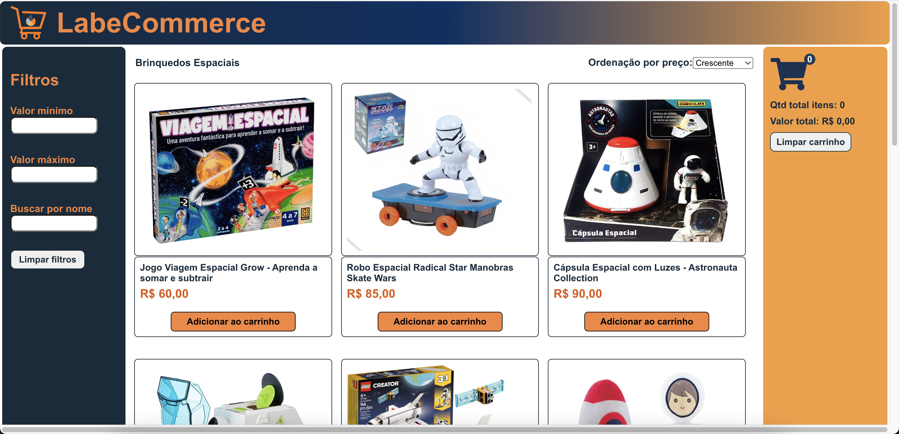
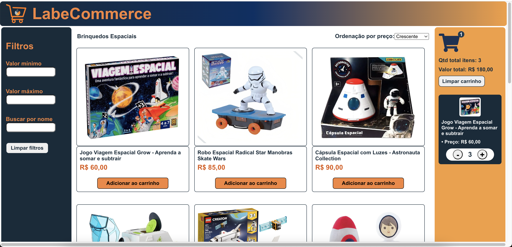
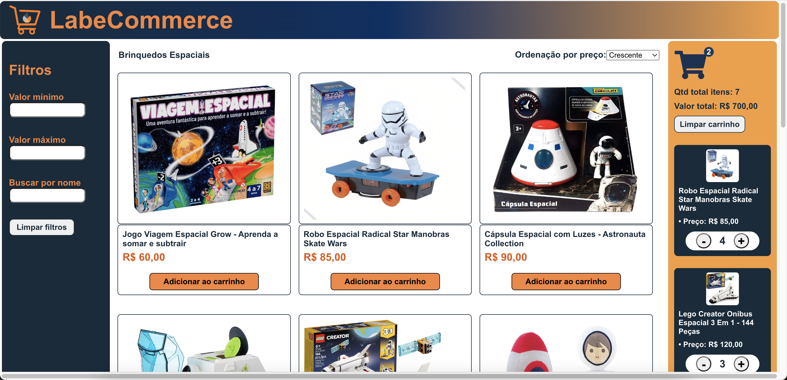
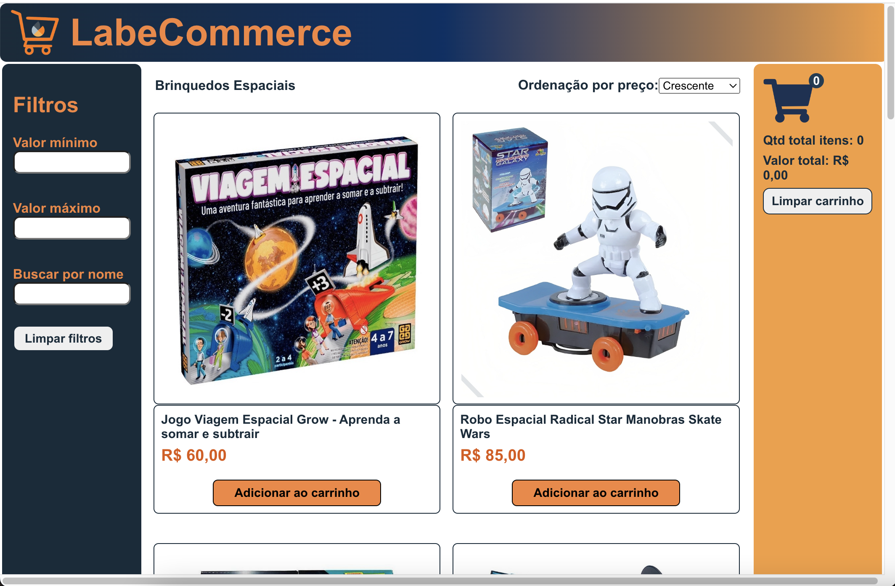
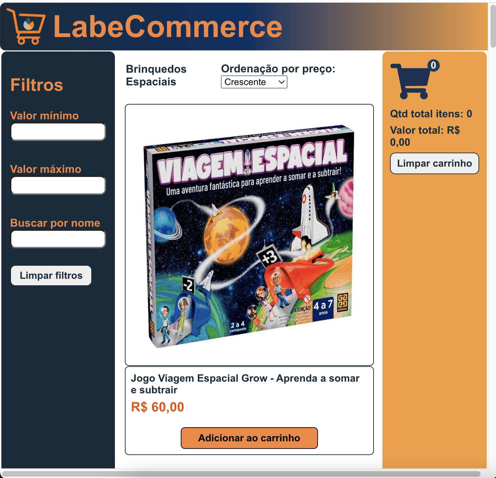

# Link do surge

https://projeto-ecommerce-react-leonardocanone.surge.sh

# Qual era o objetivo do projeto-frontendreact

Esse foi o projeto de introdução aos fundamentos do React. Aqui praticamos a estrutura do que se considera ser a base do React. O objetivo principal era criar um site que funcionasse exatamente como o front-end de um E-Commerce. Listo abaixo os conhecimentos utilizados neste projeto:

- JSX
- Componentes
- Props
- Estado
- Fluxo de dados no React
- Renderização de listas
- Renderização condicional
- localStorage

## Instruções do cliente (Bootcamp Labenu)

O Astrodev deixou um testamento e essa foi a herança deixada pra vocês:

```
Estudantes do meu coração,
Estou querendo montar um e-commerce de itens espaciais e vocês serão responsáveis por essa construção. 
Pretendo montar diferentes linhas de produtos. 

As possíveis linhas de produto são:
- Satélites antigos;
- Roupas espaciais;
- Camisetas com estampas divertidas relacionadas ao espaço;
- Viagens espaciais;
- Meteoritos / aerolitos como pedras preciosas;
- Brinquedos e produtos infantis temáticos;
- Naves / Foguetes / Ônibus espaciais;

Escolham uma linha dentre essas, e criem um e-commerce de acordo com a lista de requisitos.

Att.
```
###

## Abaixo os prints da versão desktop

Primeira imagem ainda com o carrinho de compras vazio


Primeiro produto adicionado ao carrinho


Mais produtos adicionados ao carrinho, vejam os totais devidamente somados


## Abaixo os prints das versões para tablet e smartphone

Visão de tablet na horizontal



###
Visão de tablet na vertical



###
Visão do smartphone ainda sem produtos adicionados


###
Visão do smartphone agora com produtos adicionados ao carrinho


###

# Requisitos gerais da escola

O projeto consistirá em 3 grandes partes:

1. Home
    - Mostrando todos os produtos
    - Deve haver alguma forma de ordenar os produtos por ordem crescente ou decrescente de preço (pode ser na home em si ou junto dos filtros)
    - Produtos:
        - Devem ter um botão que permita adicioná-los ao carrinho
        - Devem exibir o nome, preço e imagem em um card
2. Carrinho
    - Mostrar todos os produtos e quantidades adicionadas
    - Capacidade de remover itens do carrinho
    - Mostrar o valor total do carrinho
3. Filtro
    - Por valor mínimo e máximo
    - Por nome do produto


## Lista de Requisitos detalhada
- Home (Lista de Produtos)
    - [ ]  O usuário deve ser capaz de visualizar uma lista de produtos
    - [ ]  O usuário deve ser capaz de visualizar os dados do produto (nome, preço e imagem)
    - [ ]  O usuário deve ser capaz de adicionar um produto no carrinho
- Carrinho
    - [ ]  O usuário deve ser capaz de visualizar os produtos adicionados
    - [ ]  O usuário deve ser capaz de visualizar a quantidade correta de cada produto
    - [ ]  O usuário deve ser capaz de remover itens do carrinho
    - [ ]  O usuário deve ser capaz de ver corretamente o valor total de sua compra
    - [ ]  Quando a página é atualizada, os itens devem continuar no carrinho
- Filtros e Ordenação
    - [ ]  O usuário deve ser capaz de filtrar os itens por preço mínimo
    - [ ]  O usuário deve ser capaz de filtrar os itens por preço máximo
    - [ ]  O usuário deve ser capaz de realizar uma busca por nome
    - [ ]  O usuário deve ser capaz de ordenar os itens em ordem crescente ou decrescente
    - [ ]  O usuário deve ser capaz de adicionar  filtros, busca e ordenação simultaneamente
    - [ ]  O usuário deve ser capaz de retornar à visualização sem filtros


  ### Conseguiu terminar? Aqui temos alguns **desafios**
  1. Salvar e Recuperar conteúdo do carrinho usando o `LocalStorage`;
  
  Anotação Leonardo: Desafio 1 devidamente implementado. 

  2. Dediquem um tempo para melhorar o layout e a usabilidade do seu site! Se baseiem em outros e-commerces que vocês gostam para chegar em um resultado mais próximo do padrão de design visto no mercado;
  
  Anotação Leonardo: Resolvi acrescentar a visualização total dos itens no carrinho, além do valor total que é obviamente um requisito obrigatório. Saber a quantidade total de volumes que se está comprando é um dado muito importante para o usuário evitar erros no seu processo de compra. Outra preocupação foi deixar o site devidamente responsivo tanto para desktops, tablets quanto smartphones. 

